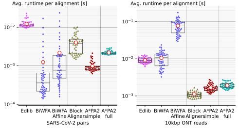

# PA-Bench: a framework for benchmarking pairwise aligners

Ragnar Groot Koerkamp and Daniel Liu

## Abstract

### Motivation
The problem of pairwise alignment using Smith-Waterman dynamic programming (DP) has been studied for over 60 years,
but still many advancements are being made.
This is for good reason: alignment accounts for a significant fraction of the
time spend in real-world bioinformatics pipelines,
especially with long genomes and recent long read technologies.
In fact, there has been substantial recent work on designing faster `alignment-free' algorithms, but DP alignment still provides
gold standard results compared to those methods.

To date, there has not been a scalable and comprehensive benchmark suite for DP aligners.
Many algorithm developers build their own ad-hoc benchmarks, but they fail to account for the diversity of downstream use cases.
For example, it is possible to align reads to genomes, genomes to genomes, reads to other reads, etc.
Pairs of sequences can vary widely, from small substitutions or insertions/deletions (indels), to large structural variations
driven by biology.
This problem is amplified by the rapid increase in sequencing technologies that produce reads with varying error
profiles and length characteristics, including short Illumina reads, long PacBio HiFi reads, ultra-long Oxford Nanopore reads,
and other emerging technologies.
Thus, we set out to build a framework to make it easier for algorithm developers to compare their algorithms with others on a
wide variety of data and allow downstream algorithm users to make informed choices in picking the right algorithms for their
data.

To limit the scope of the benchmarks, we chose to focus on the simplest task of global alignment of DNA sequences.
Although this does not capture the full complexity of real-world use cases, which include semi-global, local, etc. alignment
or other data types like proteins, graphs, etc., this still allows us to better understand the performance characteristics of alignment
algorithms.

### Methods
At a high level, PA-Bench wraps existing aligners in a uniform interface,
provides a command-line tool for running these wrapper individually,
and provides a command-line tool to orchestrate a set of jobs for benchmarking different aligners on different datasets.
New aligners can easily be supported by implementing the simple interface.

PA-Bench's main interface takes a `YAML` file that allows the user to specify a
number of things:
- The datasets to run on, which can be either an input file, a download link, or
parameters to generate pseudo-random sequences.
- Whether to compute only the distance or also a traceback.
- The cost model to use.
- The algorithms to run.

For example, the below configuration can be used to compare the scaling with
length of Edlib and WFA.

[Maybe this is too much; but it feels like an example is shorter than
explaining the equivalent in words.]
```yaml
- time_limit: 1h
  mem_limit: 32GiB
  datasets:
    - !Generated
      seed: 31415
      error_rates: [0.05]
      error_models: [Uniform]
      lengths: [1000, 10000, 100000, 1000000, 10000000]
      total_size: 10000000
  traces: [true]
  costs: [{ sub: 1, open: 0, extend: 1 }]
  algos:
    - !Edlib
    - !Wfa
```

These jobs are automatically executed on multiple threads for testing or a single thread for benchmarking.
PA-Bench allows setting limits on the runtime and memory usage of jobs, and it gracefully handles
resource exhaustion and errors.
To test the accuracy of aligners, especially those with approximate algorithms, PA-Bench verifies alignment results
by checking the returned CIGAR for consistency and comparing the cost of the
alignment returned by different algorithms.
Additionally, to speed up development iteration time, PA-Bench caches job results by default to avoid rerunning successful jobs.
Finally, PA-Bench outputs benchmark results in a `JSON` format that includes
among others:
- the returned and opimal costs of all alignments,
- the time and memory usage of each job,
- the CPU frequency when the job started and finished,
Example experiments and scripts to parse and plot benchmark results are provided.

PA-Bench has proven useful for rapidly testing and benchmarking aligners, and
it has been used in practice to both run the benchmarks for A\*PA and discover bugs in other aligners.

### Results
Code for PA-Bench can be found at [github.com/pairwise-alignment/pa-bench](github.com/pairwise-alignment/pa-bench).

An example of an experiment and figure generated by PA-Bench is the following
figure:



This shows the running times of various aligners on two datasets, one of
SARS-CoV-2 pairs with $1.5\%$ average divergence, and one of ONT reads of
average length $10$kbp, with $11\%$ average divergence. For BiWFA-Affine and
Block Aligner, affine costs with substitution, indel, and gap-open cost $1$ are
used. It can be seen that for the similar SARS-CoV-2 reads, affine BiWFA is fast
and only slightly slower than linear BiWFA, while for the much more divergent
ONT reads, affine BiWFA is much slower than all other methods.

### Discussion
PA-Bench is a convenient tool for efficiently and accurately comparing pairwise aligners.
While currently only pairwise alignment is supported, it could be useful to
extend this framework to other problems as well, including e.g.
sequence-to-graph alignment and possibly also datastructure oriented
problems such as coloured De Bruijn graph construction and compression.


# TODO

- I feel like we should somewhere stress that proper benchmarking is a more
  general problem that doesn't seem to be taken very 'serious' in papers. Nobody
  explains their setup and/or verifies that CPU frequency is constant.
- write something specifically about the many methods for affine SIMD (KSW2,
  Block Aligner, BSAlign), maybe proberly cite some/all of them. (i can add them.)
- Write that this makes most sense for jobs between 0.01s to a few hours. Not
  really for day-long / one-off jobs.
